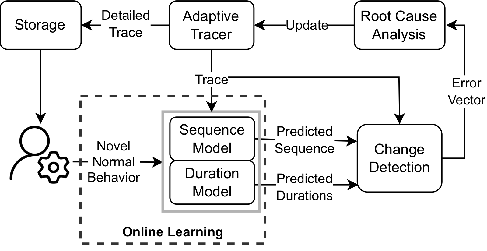

# LMAT — Language-Model-based Adaptive Tracing

[](https://doi.org/10.1145/3639476.3639778)
[](https://doi.org/10.1016/j.jss.2026.112890)
[](https://doi.org/10.5281/zenodo.10437041)
[](https://www.python.org/)
[](https://pytorch.org/)
[](LICENSE)

Kernel tracing gives you the richest possible view of a running system — and an
unmanageable volume of data to store. LMAT learns what normal looks like, modeling both
**which** system calls a request makes and **how long** each one takes, then keeps tracing
coarse until live behavior stops matching the prediction. When it diverges, the tracer
turns up granularity and the same prediction errors are used to name the likely fault.

On an Apache2 web-server workload this records **70.6% less trace data** while losing only
**3.2%** of the events tied to abrupt behavior changes, and identifies the fault source
with **97.7%** end-to-end accuracy.

<p align="center">
  
</p>

> **Research code.** This repository is the artifact accompanying the two papers below,
> released for reproducibility rather than as a maintained library.

## Papers

| | |
|---|---|
| **Toward Adaptive Tracing: Efficient System Behavior Analysis using Language Models**<br>Darvishi, Noferesti, Ezzati-Jivan — ICSE-NIER 2024, pp. 62–66 | [doi:10.1145/3639476.3639778](https://doi.org/10.1145/3639476.3639778) |
| **LMAT: An adaptive tracing approach based on efficient system behavior analysis using language models**<br>Darvishi, Noferesti, Sehgal, Ezzati-Jivan — Journal of Systems and Software, vol. 238, art. 112890, 2026 | [doi:10.1016/j.jss.2026.112890](https://doi.org/10.1016/j.jss.2026.112890) |

The ICSE-NIER paper is the four-page early version of the idea; **LMAT** is the full
journal extension, which adds the duration-modeling design, the root-cause classifier, a
second evaluation on a containerized microservice benchmark, and a deployment overhead
study. This repository holds the code for the Apache2 experiments reported in both. The
microservice (Sock Shop) experiments live on the [`microservices`](../../tree/microservices)
branch.

## Results

All figures below are from the journal paper, on the Apache2 workload.

| | |
|---|---|
| Reduction in recorded trace volume | **70.6%** |
| Events lost on abrupt behavior changes | **3.2%** — over 3× worse using event sequences alone |
| Change detection + root-cause identification, end to end | **97.7%** |
| Change detection at 7 duration categories | **F1 98.2 ± 1.2**, AUC 99.6 ± 0.3 |
| Duration model accuracy, in-distribution test set | **92.7%** |
| Deployment overhead | no measurable latency or throughput cost beyond tracing itself |

Modeling durations alongside event sequences is what buys the accuracy: an
event-sequence-only model reaches a slightly larger volume reduction but loses more than
three times as much of the behavior it was supposed to capture.

The journal paper also evaluates the same design on the Sock Shop microservice benchmark,
where host-local change detection still works (best average F1 ≈ 65 at 5 duration
categories) but root-cause attribution across services is substantially harder — a
limitation stated plainly in the paper and worth knowing before reusing this on a
distributed system.

## How it works

- **Input representation** (`models/Embedding.py`) — each event is a concatenation of
  learned embeddings (system call name, entry/exit, return value, process name) and
  sinusoidal encodings (PID, TID, position within the request, inter-event time). Any
  field is disabled by setting its dimension to `0`, which is how the ablations are run.
- **Backbone** — either a stacked `nn.LSTM` (`models/LSTM.py`) or a causal Transformer
  encoder (`models/Transformer.py`) with an optional SwiGLU feed-forward, T-Fixup
  initialization, and gradient checkpointing for sequences up to 2048 events.
- **Two heads, one model** — one predicts the next system call, the other classifies the
  duration of the current event into *k* bins (*k* ∈ {3, 5, 7, 9}, with ordinal and
  continuous variants available). Training either head alone reproduces the single-task
  baselines.
- **Change detection** — per-request cross-entropy of both heads is combined and compared
  against a threshold chosen on validation data to maximize F1.
- **Trigger and root cause** — detailed tracing starts once more than 80% of the requests
  in a window are flagged (`functions.py:3005`), and the prediction-error vectors feed a
  classifier that maps the deviation to a fault source.

## Repository layout

| Path | Contents |
|---|---|
| `main.py` | Entry point — argument parsing, dataset construction, training, evaluation, analysis |
| `functions.py` | Training loop (DistributedDataParallel), evaluation, adaptive-tracing simulation, root-cause analysis, n-gram baseline |
| `models/` | `Embedding`, `LSTM`, `Transformer`, `MyMultiheadAttention`, `SwiGLU`, `LabelSmoothingCrossEntropy` |
| `dataset/` | Trace loaders and vocabulary — code, not data |
| `scripts/` | SLURM job scripts for the 5-seed × {LSTM, Transformer} sweep |
| `docs/` | Figures |

## Setup

```bash
python3 -m venv venv
source venv/bin/activate
pip install -r requirements.txt
```

Developed against Python 3.11 and PyTorch 2.x. Training uses `DistributedDataParallel`
across the GPUs listed in `--gpu`; `nltk` is only needed for the n-gram baseline
(`--model ngram`).

## Data

The kernel traces are published on Zenodo:
[doi:10.5281/zenodo.10437041](https://doi.org/10.5281/zenodo.10437041) — a 19 GB
`trace_data.tar.gz` of LTTng traces from an Apache2 web server under a `wrk2` load, one
subset of normal behavior plus seven subsets each carrying a distinct injected fault.
Licensed CC-BY-4.0, and built on the corpus of Fournier et al.

Unpack it so that `--data_path` points at a directory laid out like this:

```
<data_path>/
├── train_id/                  # normal behavior, training
├── valid_id/                  # normal behavior, validation
├── test_id/                   # normal behavior, test
├── valid_ood_connection/      # one folder per injected fault
├── valid_ood_cpu/
├── valid_ood_dumpio/
├── valid_ood_opcache/
├── valid_ood_socket/
├── valid_ood_ssl/
└── test_ood_*/                # the same six faults, test split
```

Folders are passed as `"Display name:folder"` pairs, comma-separated for the
out-of-distribution sets. The **first** run must pass `--generate_dataset`, which parses
the raw traces, builds `dict_sys.pkl`, `dict_proc.pkl` and `dict_delay_spans.pkl` in
`--data_path`, and writes a `data.txt` into each folder. Later runs reuse them and should
omit the flag.

Note on `--n_categories`: it takes the number of duration bins **plus one** for entry
events, so the paper's 7-category setting is `--n_categories 8`. Valid values are 4, 6, 8
and 10. The duration bin edges are computed during dataset generation, so the value passed
with `--generate_dataset` must match the value used for training — or prepare the data with
several tag sets and select between them at training time with `--multi_category`.

## Reproducing a result

The multi-task LSTM at the paper's Apache operating point (7 duration categories, seed 1):

```bash
python main.py \
  --log_folder logs/lstm-1 \
  --data_path /path/to/trace_data \
  --generate_dataset \
  --train_folder "Train:train_id" \
  --valid_id_folder "Valid ID:valid_id" \
  --test_id_folder "Test ID:test_id" \
  --valid_ood_folders "Valid OOD (Connection):valid_ood_connection,Valid OOD (CPU):valid_ood_cpu,Valid OOD (IO):valid_ood_dumpio,Valid OOD (OPCache):valid_ood_opcache,Valid OOD (Socket):valid_ood_socket,Valid OOD (SSL):valid_ood_ssl" \
  --test_ood_folders "Test OOD (Connection):test_ood_connection,Test OOD (CPU):test_ood_cpu,Test OOD (IO):test_ood_dumpio,Test OOD (OPCache):test_ood_opcache,Test OOD (Socket):test_ood_socket,Test OOD (SSL):test_ood_ssl" \
  --model lstm --n_hidden 256 --n_layer 2 \
  --dim_sys 48 --dim_proc 48 --dim_entry 12 --dim_ret 12 \
  --dim_pid 12 --dim_tid 12 --dim_time 12 --dim_order 12 --dim_f_mean 0 \
  --optimizer adam --lr 0.001 --ls 0.1 --batch 16 --clip 10 \
  --n_update 1000000 --eval 1000 --dropout 0.01 \
  --reduce_lr_patience 5 --early_stopping_patience 20 \
  --gpu "0,1,2,3" --amp \
  --n_categories 8 --train_event_model --train_latency_model \
  --analysis --seed 1
```

Results are written to `--log_folder` (`log.txt`, the trained `model`, and the analysis
plots). Swap `--model transformer` with `--n_hidden 672 --n_head 4 --activation swiglu
--warmup_steps 5000 --max_token 2048 --chk` for the Transformer backbone. Add
`--max_sample 1000` for a fast smoke run on a small slice of the data.

`scripts/` contains the SLURM jobs used for the full sweep — five seeds per architecture,
each on 4× V100.

## Citation

```bibtex
@inproceedings{darvishi2024toward,
  title     = {Toward Adaptive Tracing: Efficient System Behavior Analysis using Language Models},
  author    = {Darvishi, Kasra and Noferesti, Morteza and Ezzati-Jivan, Naser},
  booktitle = {Proceedings of the 2024 ACM/IEEE International Conference on Software
               Engineering: New Ideas and Emerging Results (ICSE-NIER)},
  pages     = {62--66},
  year      = {2024},
  publisher = {ACM},
  doi       = {10.1145/3639476.3639778}
}

@article{darvishi2026lmat,
  title   = {{LMAT}: An adaptive tracing approach based on efficient system behavior
             analysis using language models},
  author  = {Darvishi, Kasra and Noferesti, Morteza and Sehgal, Yuvraj and
             Ezzati-Jivan, Naser},
  journal = {Journal of Systems and Software},
  volume  = {238},
  pages   = {112890},
  year    = {2026},
  doi     = {10.1016/j.jss.2026.112890}
}
```

## License

MIT — see [LICENSE](LICENSE).

## Acknowledgments

Carried out in the Department of Computer Science, Brock University, in collaboration with
our industry partner Ciena. Computing resources were provided by the Digital Research
Alliance of Canada. The Apache2 trace corpus builds on the dataset of Fournier et al.
